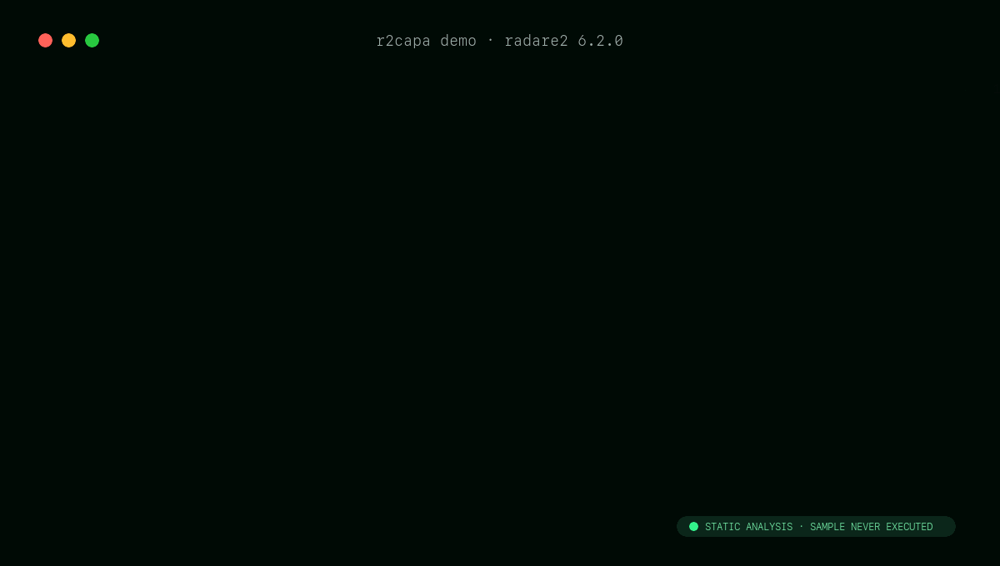

# r2capa

[](https://github.com/curvefive/r2capa/actions/workflows/ci.yml)
[](https://github.com/curvefive/r2capa/actions/workflows/native-plugin.yml)
[](https://github.com/curvefive/r2capa/actions/workflows/codeql.yml)
[](LICENSE)

Run [capa](https://github.com/mandiant/capa) against the active
[radare2](https://github.com/radareorg/radare2) analysis. r2capa uses r2's recovered functions,
basic blocks, instructions, imports, strings, xrefs, flags, base address, and current I/O view.

> Status: alpha. The first compatibility target is PE/ELF x86 and x86-64 with radare2 6.2 and
> capa 9.x.

## Highlights

- Native radare2 commands with capa's default, verbose, and JSON renderers.
- File, function, basic-block, and instruction feature extraction from structured r2 data.
- Current-function matching and r2 flag-script output for interactive investigation.
- Static-only operation: r2capa never executes the analyzed sample.

## Install

Requirements: Python 3.10+, radare2 6.2.0+, a C compiler, `pkg-config`, and radare2 development
headers. Install the Python application with `pipx`; do not modify Homebrew's managed Python.

```sh
git clone https://github.com/curvefive/r2capa
cd r2capa

brew install pipx pkg-config      # macOS; use your package manager on Linux
pipx ensurepath
export PATH="$HOME/.local/bin:$PATH" # current shell; future shells use pipx's update
pipx install .
make -C plugin install

git clone https://github.com/mandiant/capa-rules ~/.local/share/r2capa/rules
export R2CAPA_RULES="$HOME/.local/share/r2capa/rules"
```

Use the capa-rules release matching capa's major version.

## Use



```text
$ r2 sample.exe
[0x00401000]> aaa
[0x00401000]> r2capa
[0x00401000]> r2capavv
[0x00401000]> r2capaf
[0x00401000]> r2capaj
[0x00401000]> r2capa*
```

`r2capaf` restricts matching to the current function. `r2capa*` emits an r2 script that creates a
`capa` flagspace; apply it explicitly with `.r2capa*`. Run `r2capa?` for all commands. The prefix
avoids radare2's existing `cat` command, which otherwise consumes commands beginning with `capa`.

Without the native command plugin, invoke the worker directly from r2:

```text
[0x00401000]> #!pipe r2capa --verbose
```

Custom rules can be selected with `R2CAPA_RULES=/path/to/rules`. Analyst-resolved APIs can be
declared without treating every rename as trusted API metadata:

```text
[0x00401000]> f capa.api.kernel32.CreateFileW @ 0x00403000
```

## Develop

```sh
make bootstrap
.venv/bin/pre-commit install
make check
make plugin                    # requires an installed radare2 SDK
```

The regression suite uses deterministic r2 JSON fixtures and an end-to-end capa rule match, so
normal Python CI does not execute an untrusted binary. A separate workflow builds and smoke-tests
the complete native path against radare2 6.2.0.

## Limitations

- Extraction quality follows the active r2 analysis; run `aaa` before `r2capa`.
- Structured operand data varies by r2 architecture plugin. Text parsing is deliberately limited.
- .NET, shellcode configuration, embedded PE detection, FLIRT library filtering, and a graphical
  iaito explorer are planned, not yet implemented.
- r2capa performs static analysis only and never executes the sample.

Apache-2.0 licensed. Created by CurveFive with Mouse. Contributions are welcome; see
[CONTRIBUTING.md](CONTRIBUTING.md). Please report vulnerabilities according to
[SECURITY.md](SECURITY.md).
